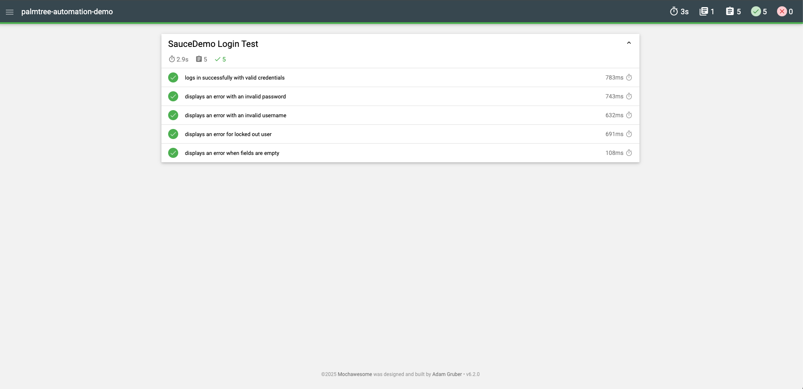

# PalmTree Web & Mobile Automation Demo

Welcome to the PalmTree Solutions Automation Demo.  
This repository showcases an end-to-end automated testing setup using **Cypress** for web and **Appium + WebdriverIO** for mobile (iOS Simulator), with Mochawesome reporting and a clean, CI/CD-ready architecture.

---

## Tech Stack

- Cypress – Web UI Testing Framework
- Mochawesome – Test Reporting
- CircleCI (optional) – Continuous Integration Pipeline
- GitHub – Source Control and Hosting

---

## Features Tested

- Login Flow
  - Valid and invalid credential scenarios
  - Error message validation
- Add to Cart Flow
  - Adding items to cart
  - Verifying cart contents
- Checkout Flow
  - Filling in customer information
  - Verifying successful order placement

---

## Setup Instructions

1. Clone the repository:

   ```bash
   git clone https://github.com/bp662/palmtree-automation-demo.git
   cd palmtree-automation-demo

2. npm install - Install dependencies

Note: Cypress is installed locally as a devDependency.  
If you get a "Cannot find module 'cypress'" error, run:

npm install cypress --save-dev

3. npx cypress open - Run Cypress tests

4. npx cypress run - Run tests with Mochawesome reporting

5.	(Optional) View test reports inside /cypress/reports/mochawesome/

---

## Mobile (iOS) – Appium + WebdriverIO

This repo also includes a minimal iOS Safari flow against `saucedemo.com`, aligned with the web test cases.

### Prereqs
- Xcode with iOS Simulator 18.6 installed (Xcode → Settings → Components → iOS 18.6 + Simulator)
- Node.js (installed)
- Appium v3 (`npm i -g appium`)
- Appium XCUITest driver (`appium driver install xcuitest`)

### Files
- `mobile-automation/saucedemo-login-addtocart.js` – Sample iOS Safari test

### Run All Mobile Tests

To execute all iOS mobile tests back-to-back:

```bash
npm run mobile:all
```

## Sample Test Report

Below is a screenshot of a sample Mochawesome report generated after running the Cypress tests:

